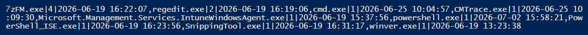

# Clauses & Chaos — App Launch Counts

`Get-AppLaunchCounts.ps1` is an Intune **detection** script that reports how many times a curated list of applications has been launched by the logged-on user(s) on a device, along with the **last launch date/time** of each app.

## How it works

Windows records, per user, how many times each program was started from Windows Explorer (Start menu, taskbar, double-click, etc.) in the **UserAssist** registry keys:

```
HKEY_USERS\<SID>\Software\Microsoft\Windows\CurrentVersion\
    Explorer\UserAssist\{CEBFF5CD-ACE2-4F4F-9178-9926F41749EA}\Count
```

Each value *name* is a ROT13-encoded full path to the executable, and its binary data holds a run count (DWORD at byte offset 4) and a last-execution `FILETIME` (8 bytes at byte offset 60).

The script:

1. **Resolves the user hives to inspect.** Running as SYSTEM (the Intune default) it enumerates every loaded real-user hive under `HKEY_USERS` (SIDs starting `S-1-5-21-`); running in the user context it reads `HKCU`. Counts are summed across all matched users.
2. **Decodes each UserAssist entry** from ROT13 and extracts the executable file name, its run count and its last-execution time.
3. **Tallies launches per app.** Executables are matched against the curated `$SelectApps` list (several executables can roll up to one friendly app name), keeping the most recent last-launch time seen across all matched executables and users. If `$SelectApps` is empty, **every** executable found in UserAssist is reported instead, keyed by file name and ordered by launch count (highest first).
4. **Emits a single line to STDOUT** captured in Intune's detection output:

   ```
   <AppName>|<Count>|<LastLaunch>,<AppName>|<Count>|<LastLaunch>,...
   ```

   `<LastLaunch>` is the most recent launch in local device time (`yyyy-MM-dd HH:mm:ss`, empty when never launched), e.g.:

   ```
   7zip|2|2026-06-30 08:15:04,Acrobat|4|2026-07-01 17:42:19,MSWord|6|2026-07-02 09:03:55
   ```

5. **Respects Intune's 2048-character detection-output limit.** If the line is too long it retries with abbreviated (extension-stripped) names; if still too long, the full line is written to a log under `C:\ProgramData\Microsoft\IntuneManagementExtension\Logs` and STDOUT points to it. The script always exits `0`.

## Configuration

Edit the `$SelectApps` block at the top of the script to choose which apps to report and which executable file names map to each friendly name:

```powershell
$SelectApps = @(
    [pscustomobject]@{ Name = '7zip';    Executables = @('7zFM.exe', '7zG.exe', '7z.exe') }
    [pscustomobject]@{ Name = 'Acrobat'; Executables = @('Acrobat.exe', 'AcroRd32.exe', 'AcroCEF.exe') }
    [pscustomobject]@{ Name = 'MSWord';  Executables = @('WINWORD.EXE') }
)
```

Leave the list empty (`$SelectApps = @()`) to report **every** launched executable on the device. Set `$IncludeZeroCounts = $false` to omit apps with no recorded launches.


## Example output




## Intune configuration

| Setting | Recommended value |
|---------|-------------------|
| Script type | Custom **Detection** script (Remediations, or a Win32 app custom detection rule) |
| Run using logged-on credentials | **No** — runs as SYSTEM and sums every loaded user hive (**Yes** reads `HKCU` only) |
| Enforce script signature check | No (unless you sign the script) |
| Run script in 64-bit PowerShell | **Yes** (avoids registry redirection) |

## Limitations

- UserAssist only records launches made through Windows Explorer. Programs started by the system, services, scripts or scheduled tasks are not counted.
- When running as SYSTEM, a user's counts are only readable while their hive is loaded (i.e. they are logged on). Offline profiles are not mounted.
- UserAssist must be enabled (it is by default on Windows 10/11).

> **Disclaimer:** This script is provided "as is", without warranty of any kind. It is not an official Microsoft product and is not supported by Microsoft. Review and test in a non-production environment before deploying through Intune.
